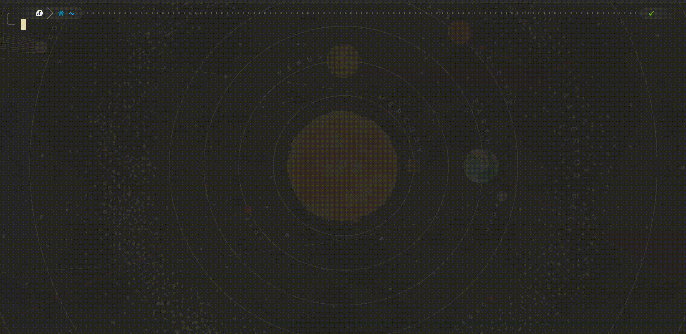

# TuiRedisGO

Interactive Redis TUI built with [bubbletea](https://github.com/charmbracelet/bubbletea) and [lipgloss](https://github.com/charmbracelet/lipgloss).



## Requirements

- Go 1.25+
- A running Redis instance

## Installation

```bash
go install ./cmd/redis-viewer
```

Or run directly:

```bash
go run ./cmd/redis-viewer
```

## Keyboard shortcuts

| Key      | Action                             |
|----------|------------------------------------|
| `Ctrl-n` | Add new connection                 |
| `Ctrl-l` | List active connections            |
| `Ctrl-c` | Quit                               |
| `Esc`    | Back / return to main screen       |
| `Tab`    | Next field (in connection form)    |
| `Enter`  | Confirm / connect / execute command|
| `Up`     | Scroll up in menu                  |
| `Down`   | Scroll down in menu                |

## Supported commands

Type commands in the workspace after connecting to a Redis instance.

| Command  | Syntax                              | Description                       |
|----------|-------------------------------------|-----------------------------------|
| `SET`    | `SET key value [NX\|XX] [EX sec]`  | Set a key with optional flags     |
| `GET`    | `GET key`                           | Get the value of a key            |
| `DEL`    | `DEL key [key ...]`                 | Delete one or more keys           |
| `EXISTS` | `EXISTS key`                        | Check if a key exists (stub)      |
| `EXPIRE` | `EXPIRE key seconds`               | Set a TTL on a key (stub)         |
| `clear`  |                                     | Clear command history             |

### SET options

Currently parsed by the command processor:

- `NX` -- only set if the key does not already exist
- `XX` -- only set if the key already exists
- `EX <seconds>` -- set expiration in seconds

Supported by the adapter but not yet parsed from input:

- `PX <milliseconds>` -- set expiration in milliseconds
- `EXAT <timestamp>` -- set expiration as Unix timestamp (seconds)
- `PXAT <timestamp>` -- set expiration as Unix timestamp (milliseconds)
- `KEEPTTL` -- retain the existing TTL when overwriting

## Project structure

```
cmd/redis-viewer/       Entrypoint (bubbletea TUI)
internal/
  cmd/                  Command types (RedisCmdData, SetOptions)
  processor/            Input parsing, command building, dispatch
  redis/
    protocol.go         Adapter interface (AdapterRedisProtocol)
    go-redis/           go-redis/v9 adapter implementation
  ui/
    model.go            Top-level bubbletea model
    update.go           Message handling (Update)
    view.go             Screen rendering (View)
    connections.go      Connection + history types
    forms/              Input forms (ConnectionForm)
    ui-components/      Stateless rendering helpers (banners, styles)
```

## Development

```bash
# run all tests
go test ./...

# run tests for a specific package
go test -v ./internal/processor/

# build
go build ./cmd/redis-viewer/

# local Redis for manual testing
docker compose -f docker/docker-compose.yml up -d   # localhost:6379
```

## License

MIT
